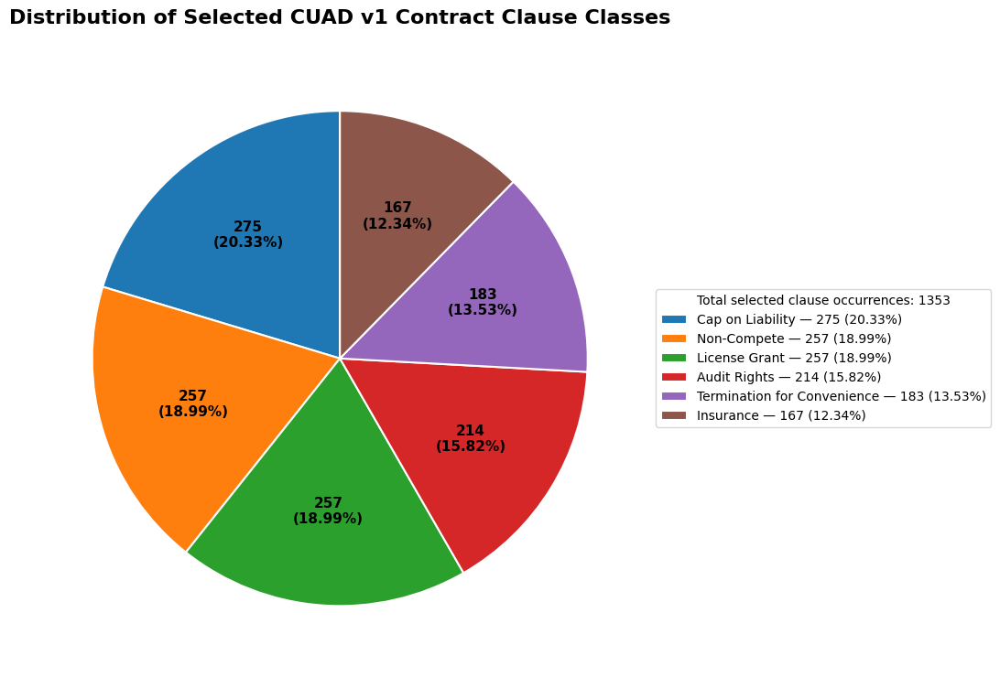

# Multi-Class Classification of Legal Documents with Risk Flagging
### Commercial Contract Law — Clause-Level Risk Detection using Attention-Based Deep Learning

---

## 1. Project Overview

This project builds a deep learning system that reads full-length commercial contracts and automatically classifies/flags high-risk clauses. We treat this as a **multi-class (multi-label) classification problem**: given a chunk of contract text, predict which of our 6 risk-relevant clause types (if any) it belongs to.

**Domain:** Commercial Contract Law
**Dataset:** [CUAD v1](https://huggingface.co/datasets/theatticusproject/cuad/tree/main/CUAD_v1) — 510 contracts, expert-annotated by The Atticus Project

**Target Clause Classes (6):**
1. Cap on Liability
2. Non-Compete
3. License Grant
4. Audit Rights
5. Termination for Convenience
6. Insurance

---

## 2. Dataset Statistical Analysis

CUAD v1 contains **510 commercial contracts** and **41 officially annotated clause categories**. For our document-length analysis, we used the available `full_contract_txt` subset containing **200 contract documents**.

### Document Statistics

| Statistic | Value |
|---|---|
| Total CUAD v1 contracts | 510 |
| Documents analyzed in text subset | 200 |
| Average words per document | 8,310.2 |
| Average lines per document | 419.77 |
| Average non-empty lines per document | 161.56 |
| Minimum words per document | 114 |
| Maximum words per document | 47,629 |

The average line count is based on the line structure of the provided TXT files. Because the files contain formatting and blank lines, the average number of non-empty lines is also reported.

**Why this matters for the project:** an average document of ~8,300 words (roughly 11,000+ tokens) is already far beyond BERT's 512-token limit, and the maximum document (47,629 words) is nearly 90x that limit. This is direct, dataset-level evidence backing **Problem 2** — it justifies why a long-context architecture (Longformer) and/or chunking strategy is necessary rather than optional for this project.

### Selected Clause Distribution

For the six selected CUAD categories, the dataset contains **1,353 selected clause occurrences**:

| Clause Class | Number of Clauses | Percentage |
|---|---|---|
| Cap on Liability | 275 | 20.33% |
| Non-Compete | 257 | 18.99% |
| License Grant | 257 | 18.99% |
| Audit Rights | 214 | 15.82% |
| Termination for Convenience | 183 | 13.53% |
| Insurance | 167 | 12.34% |
| **Total** | **1,353** | **100%** |

The classes are reasonably balanced (12–20% each), with no extreme minority class — this simplifies the class-imbalance handling in Person B/C's training pipeline compared to using all 41 CUAD labels (where some clause types have very few examples).

---

## 3. The Two Core Problems

Our teacher flagged two specific technical problems we must solve and justify — these are the intellectual core of the project, not just implementation details.

### Problem 1 — Embedding Model: How do we represent legal text numerically?

Legal language is domain-specific — words like "indemnify," "liquidated damages," or "force majeure" carry precise legal meaning that general-purpose embeddings may not capture well. We need to choose an embedding strategy that understands legal vocabulary and context.

**Our approach — evaluate and choose between:**

| Option | Description | Why consider it |
|---|---|---|
| **Legal-BERT** (`nlpaueb/legal-bert-base-uncased`) | BERT pre-trained on legal corpora (contracts, case law, statutes) | Already understands legal vocabulary out-of-the-box — best domain fit |
| **Longformer** (`allenai/longformer-base-4096`) | General-purpose but built for long documents | Needed regardless for Problem 2 (long documents) |
| **CUAD-tuned / LEGAL-BERT + Longformer hybrid** | Use Legal-BERT's tokenizer/embeddings *inside* a Longformer-style long-attention architecture | Best of both — legal-domain word understanding + long-context handling |
| **Sentence-Transformers (legal fine-tuned)** | For clause-level similarity/retrieval if needed as a supporting step | Useful if we add a clause-retrieval pre-filter before classification |

**Recommended plan:** Start with **Legal-BERT embeddings**, benchmark against **plain BERT embeddings**, and report the difference in F1 score. This becomes a concrete, gradable experiment: *"does domain-specific embedding actually improve legal clause detection?"*

### Problem 2 — Document Length: How do we represent very long documents?

Contracts can run 5,000–15,000+ tokens. Standard transformers (BERT, Legal-BERT) cap at **512 tokens** — far too short for a full contract. We need a strategy to represent the *whole* document without losing clauses or context.

**Our approach — combine two techniques:**

1. **Long-sequence architecture (Longformer):**
   Use sliding-window local attention + global attention on select tokens, extending usable context to **4,096 tokens** — handles most contracts without truncation.

2. **Sliding-window chunking (for the remainder / as a fallback):**
   For contracts still exceeding 4,096 tokens, split into overlapping chunks (e.g., 4096 tokens with a 512-token overlap) so a clause isn't cut in half at a chunk boundary. Each chunk is classified independently, then results are merged at the document level.

3. **Document-level pooling strategy:**
   Since classification happens per chunk, decide how chunk-level predictions roll up into whole-document predictions — e.g., "if ANY chunk is flagged Indemnification, the document is flagged Indemnification" (max-pooling across chunks), which is standard for CUAD-style span-extraction tasks.

**This becomes our second concrete experiment:** *"Legal-BERT with 512-token truncation vs. Longformer with 4096-token context — does long-context modeling reduce missed clauses?"*

These two problems together form the **novelty and technical backbone** of the project — the rest of the pipeline (preprocessing, training loop, evaluation, UI) supports these two core decisions.

---

## 4. Team Task Split (4 People)

Work is split by pipeline stage so each person owns a clear deliverable, but all four should sit in on the Problem 1 / Problem 2 experiment design together since that's the shared intellectual core.

### 🧑‍💻 Person A — Data Engineer (Dataset & Preprocessing)
- [ ] Download and explore CUAD v1 (`CUAD_v1.json`, contract PDFs/TXT)
- [ ] Filter dataset to only the 6 target clause categories
- [ ] Clean text (remove OCR noise, headers/footers, page numbers)
- [ ] Convert CUAD's span-annotation format into per-chunk multi-label training data
- [ ] Implement sliding-window chunking (with overlap) for long documents
- [ ] Split into train / validation / test sets (document-level split, not chunk-level, to avoid data leakage)
- [ ] Document dataset statistics: avg. document length, class distribution/imbalance per clause type
- **Deliverable:** clean, ready-to-train dataset + a data exploration notebook/report

### 🧑‍💻 Person B — Embedding & Model Architecture (Problem 1 owner)
- [ ] Set up baseline: plain BERT embeddings + simple classifier
- [ ] Set up Legal-BERT embeddings + same classifier
- [ ] Compare embedding quality (probe with clause similarity / classification F1)
- [ ] Integrate Longformer (or Legal-BERT + long-attention adaptation) as the final architecture
- [ ] Build the multi-label classification head (6 output classes, sigmoid + BCE loss)
- [ ] Handle class imbalance (weighted loss / focal loss / oversampling minority clauses)
- **Deliverable:** trained model + a short write-up: "Why Legal-BERT vs BERT — results and justification" (this directly answers Problem 1)

### 🧑‍💻 Person C — Long Document Handling & Training (Problem 2 owner)
- [ ] Implement/train the Longformer-based long-context model
- [ ] Implement chunk-level → document-level prediction pooling (max-pooling or attention-pooling across chunks)
- [ ] Run comparison experiment: BERT (512-token truncated) vs. Longformer (4096-token) on the same test set
- [ ] Tune hyperparameters (learning rate, batch size, chunk overlap size)
- [ ] Track training with metrics logging (loss curves, per-class F1 over epochs)
- **Deliverable:** trained long-context model + a short write-up: "How we represent document length — chunking strategy and results" (this directly answers Problem 2)

### 🧑‍💻 Person D — Evaluation, Interpretability & Reporting
- [ ] Implement evaluation metrics: precision, recall, F1 (per-class and macro-averaged)
- [ ] Build confusion matrix across the 6 clause classes
- [ ] Extract attention weights and build attention heatmap visualizations (highlight flagged clause text)
- [ ] Build a simple demo (script or notebook) — input: raw contract text, output: annotated/highlighted document with clause labels + confidence
- [ ] Compile final report / presentation: problem statement, architecture diagram, Problem 1 & 2 results, example outputs
- **Deliverable:** evaluation results, attention heatmap demo, final report/slides

---

## 5. Suggested Timeline

| Week | Milestone |
|---|---|
| 1 | Dataset exploration + cleaning (Person A); literature check on Legal-BERT vs BERT (Person B) |
| 2 | Baseline BERT model running end-to-end (all); chunking strategy implemented (Person A + C) |
| 3 | Legal-BERT vs BERT experiment done (Person B); Longformer long-context model training (Person C) |
| 4 | Full pipeline integration; evaluation metrics + attention heatmaps (Person D) |
| 5 | Results comparison, write-up of Problem 1 & 2 answers, final report/demo polish (all) |

---

## 6. Tech Stack

- **Language:** Python
- **Framework:** PyTorch + HuggingFace Transformers
- **Models:** `nlpaueb/legal-bert-base-uncased`, `allenai/longformer-base-4096`, `bert-base-uncased` (baseline)
- **Data handling:** HuggingFace Datasets, Pandas
- **Visualization:** Matplotlib/Seaborn, BertViz (attention heatmaps)
- **Environment:** Google Colab / Jupyter (GPU required for Longformer training)

---

## 7. Key Deliverables Summary

1. ✅ Cleaned, chunked CUAD dataset (6 clause classes)
2. ✅ Embedding comparison: BERT vs Legal-BERT (**answers Problem 1**)
3. ✅ Long-document strategy: Longformer + chunk pooling vs. truncated BERT (**answers Problem 2**)
4. ✅ Trained multi-label classifier with per-class F1 scores
5. ✅ Attention heatmap visualizations for interpretability
6. ✅ Final report/demo tying it all together
