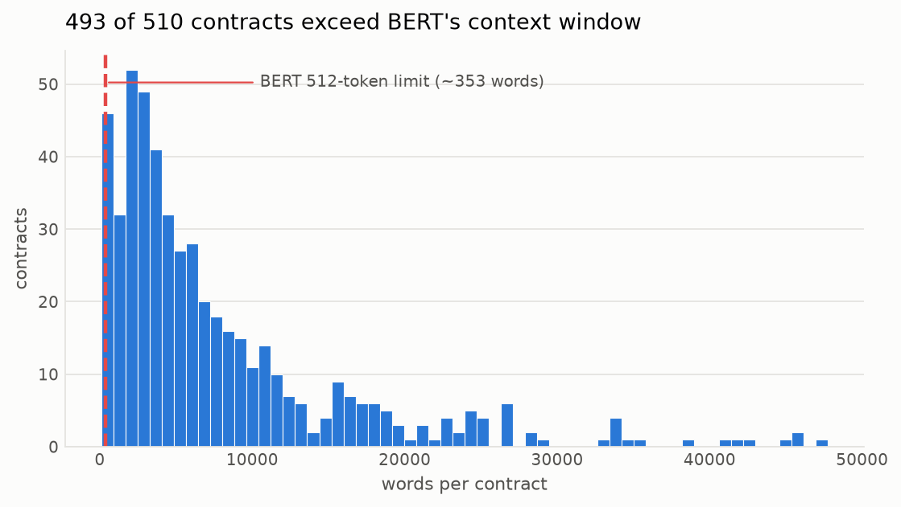
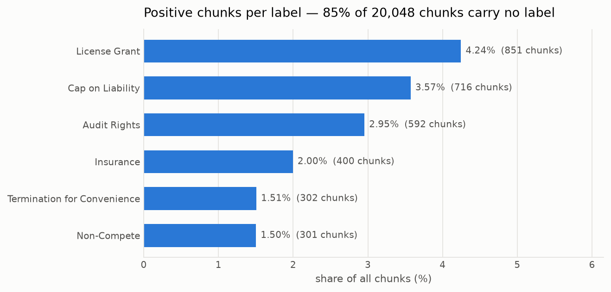
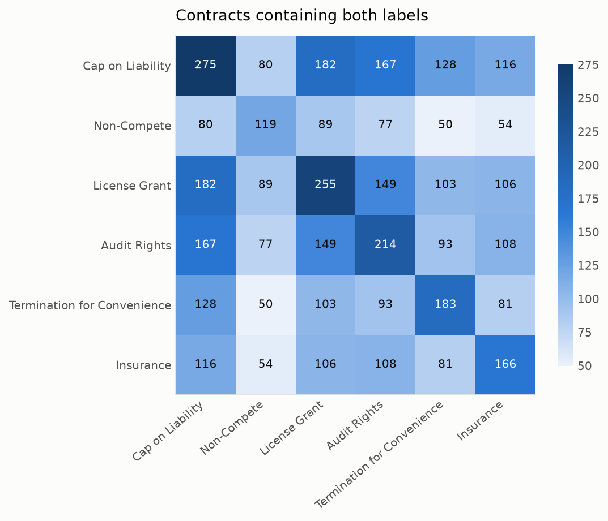
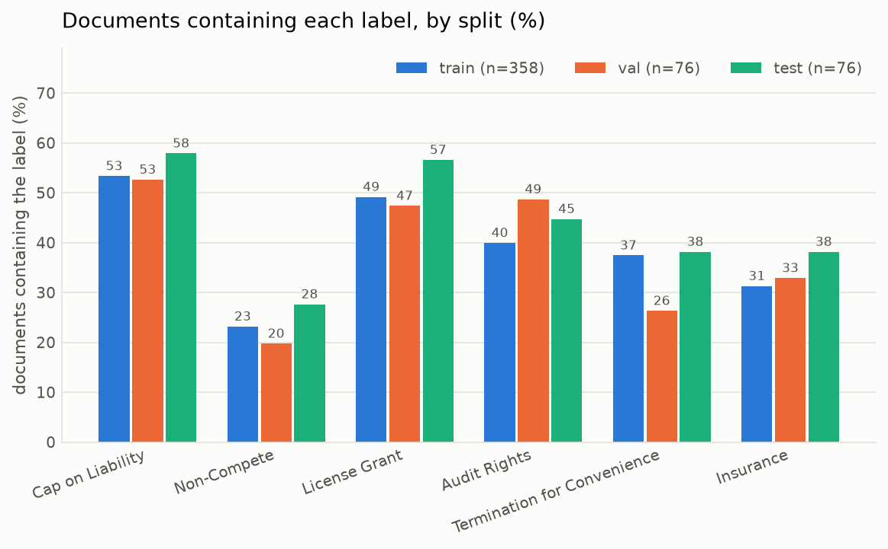

# Dataset report — CUAD v1, six risk clause categories

Generated by `legal-risk-analyze`. Every number here is reproduced from
`dataset-stats.json`; nothing is transcribed by hand.

## 1. Document length forces the architecture

| Statistic | Words | Estimated tokens |
| --- | ---: | ---: |
| min | 109 | 158 |
| p25 | 2,452 | 3,555 |
| median | 5,039 | 7,307 |
| mean | 7,861 | 11,399 |
| p75 | 10,211 | 14,806 |
| p95 | 25,298 | 36,682 |
| max | 47,733 | 69,213 |

**493 of 510 contracts (96.7%) exceed BERT's 512-token window.** 358 (70.2%) exceed Longformer's 4096.

Truncating at 512 tokens is not a small loss of context here: it discards most
of nearly every contract. Since the clauses we want sit anywhere in the document,
and insurance or liability terms usually sit late, truncation removes precisely
the text the task depends on.

The second figure matters more for the architecture: **70% of contracts
exceed Longformer's 4096-token window as well.** Long context alone does
not solve the problem, so chunking is not a fallback for the leftovers — it is required
for either model. What Longformer changes is how much context each chunk can hold, which
is the thing the Problem 2 experiment actually measures.

## 2. The real class imbalance

At a 300-word window with 100-word overlap, the corpus
yields **20,048 chunks**, of which **85.0% carry
no label at all**.

| Label | Documents | Spans | Positive chunks | Rate | pos_weight |
| --- | ---: | ---: | ---: | ---: | ---: |
| Cap on Liability | 275 | 662 | 716 | 3.57% | 27× |
| Non-Compete | 119 | 251 | 301 | 1.50% | 66× |
| License Grant | 255 | 772 | 851 | 4.24% | 23× |
| Audit Rights | 214 | 639 | 592 | 2.95% | 33× |
| Termination for Convenience | 183 | 245 | 302 | 1.51% | 65× |
| Insurance | 166 | 554 | 400 | 2.00% | 49× |

**This corrects a claim in the project brief.** The brief describes the classes as
"reasonably balanced (12–20% each)", which is true only of clause occurrences counted
among themselves. A classifier does not see clauses among themselves; it sees every
chunk of every contract, and against that denominator the positive rate for each label
is between 1.5% and 4.2%.

Three consequences follow:

1. **Accuracy is meaningless.** A model predicting all-negative scores above 95% on
   every label. Precision, recall and F1 per class are the only honest metrics.
2. **Unweighted BCE will collapse to the negative class.** The `pos_weight` column
   gives the balancing factor per label for a weighted loss.
3. **A 0.5 decision threshold is arbitrary.** Thresholds should be tuned per label on
   the validation split, and PR-AUC reported alongside F1 since it is threshold-free.

## 3. Clause length against the chunk window

| Label | Spans | Median words | p95 words | Longest |
| --- | ---: | ---: | ---: | ---: |
| Cap on Liability | 662 | 49 | 138 | 299 |
| Non-Compete | 251 | 49 | 170 | 479 |
| License Grant | 772 | 54 | 147 | 394 |
| Audit Rights | 639 | 40 | 110 | 288 |
| Termination for Convenience | 245 | 27 | 95 | 333 |
| Insurance | 554 | 37 | 115 | 350 |

The longest 5% of clauses reach about 170 words, against a 300-word
window. The 100-word overlap exists so a clause landing on a boundary
still appears whole in a neighbouring window, which the pipeline tests verify directly.

## 4. Labels co-occur, so this is multi-label

Contracts carrying more than one of the six labels:

| Distinct labels in a contract | Contracts |
| ---: | ---: |
| 0 | 93 |
| 1 | 79 |
| 2 | 109 |
| 3 | 86 |
| 4 | 76 |
| 5 | 49 |
| 6 | 18 |

338 of 510 contracts carry two or more labels, which rules out a softmax
over mutually exclusive classes. Six independent sigmoid outputs with binary
cross-entropy is the correct head.

## 5. The splits are representative

Splits are assigned per document, never per chunk: overlapping windows of one
contract would otherwise land on both sides of the split and near-duplicate text
would be scored as held out.

| Split | Documents | Cap on Liability | Non-Compete | License Grant | Audit Rights | Termination for Convenience | Insurance |
| --- | ---: | ---: | ---: | ---: | ---: | ---: | ---: |
| train | 358 | 53% | 23% | 49% | 40% | 37% | 31% |
| val | 76 | 53% | 20% | 47% | 49% | 26% | 33% |
| test | 76 | 58% | 28% | 57% | 45% | 38% | 38% |

## 6. Challenges, and what each one forces

| Challenge | Evidence | Consequence for the model |
| --- | --- | --- |
| Documents vastly exceed the context window | 97% over 512 tokens, longest 47,733 words | Chunking is mandatory; long-context models are worth comparing |
| Severe negative-class dominance | 85% of chunks unlabelled | Weighted loss, tuned thresholds, per-class metrics |
| Sparse positives per label | as few as 301 positive chunks | High variance between runs; report seeds and per-class support |
| Labels co-occur | 338 contracts carry 2+ labels | Sigmoid + BCE, not softmax |
| Annotation is span-level, supervision is chunk-level | 3,000+ spans mapped onto chunks by overlap | The overlap rule is a modelling choice, exposed as `min_overlap_ratio` |
| Legal English is domain-specific and OCR-noisy | irregular whitespace and page furniture throughout the corpus | Motivates the Legal-BERT vs BERT comparison |

